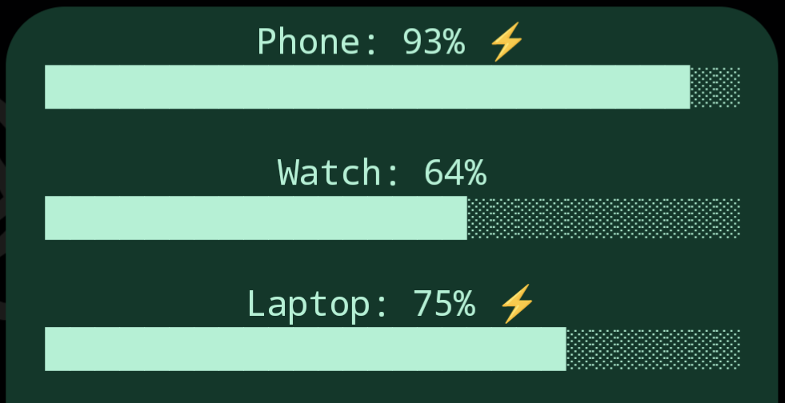

I have been working on a battery widget for my home screen to replace the Pixel battery widget, the UI is not great because it is rendered as ASCII art but I quite like it.

<!--  -->

It makes use of a [template widget](https://companion.home-assistant.io/docs/integrations/android-widgets#template) so it requires a connection to HomeAssistant even for local devices.

## Version 2

There are a few notable improvements over version 1:

- Displays when the entity was updated
- Displays remaining charge time
- Thinner, more granular battery bars
- Important devices (those that are not important are hidden when not charging or low battery)

Version 2 requires [easy_time](https://github.com/Petro31/easy-time-jinja)

```jinja




{# Name, Battery Level, Is Charging, Remaining Charge Time, Important #}

{# Min, Color #}



<tt><i><b>{{device[0]}}: {{states(device[1])|int(0)}}% ⚡ full in {{as_datetime(max(0,(states(device[3])|int(0))*60+(states.sensor[device[3].split(".")[1]].last_changed|as_timestamp(0))-(now()|as_timestamp(0)))).strftime("%H:%M")}} - {{easy_time(states.sensor[device[1].split(".")[1]].last_updated)}} ago<br /></i></b><font color="{{(colors|selectattr("0","<",states(device[1])|int(0))|first)[1]}}"><small><small>{{"█"*(((states(device[1])|int(0))/100*granularity)|int(0))}}{{"░"*(granularity-(((states(device[1])|int(0))/100*granularity)|int(0)))}}</small></small></font><small><small><small><br /><br /></small></small></small>
```

The two variables at the top hold all of the config information, `granularity` is how many characters are used in the progress bar, `devices` is a list of any number of devices, it is made up 5 parts (Name, Battery Level, Is Charging, Remaining Charge Time, Important), if you don't have a charging entity just leave it blank. If a device is important it will always be displayed, if not it will only be displayed when low battery or charging.

Feel free to modify it and improve it. If you make it better, I would love to hear!

Merry Christmas!

For Bluetooth battery levels check out my other post: [Home Assistant Bluetooth Battery Levels (Android)](/blog/bluetooth-battery-levels-android)
