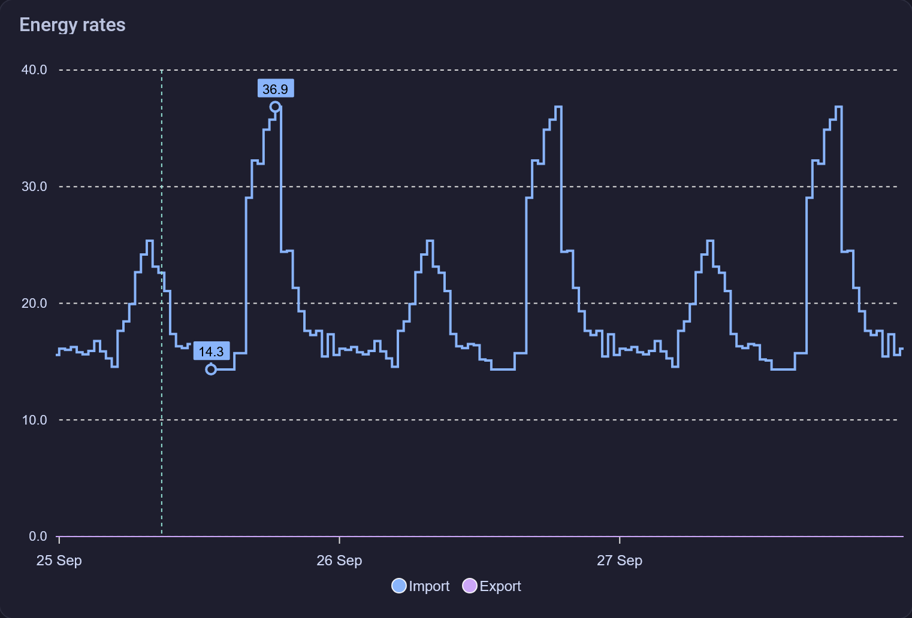
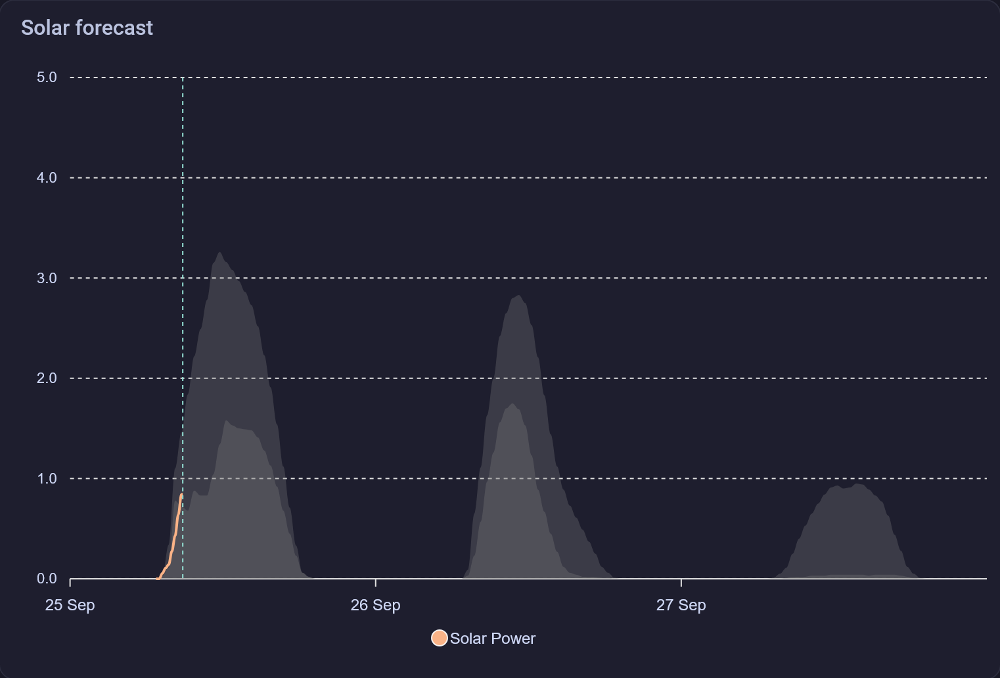
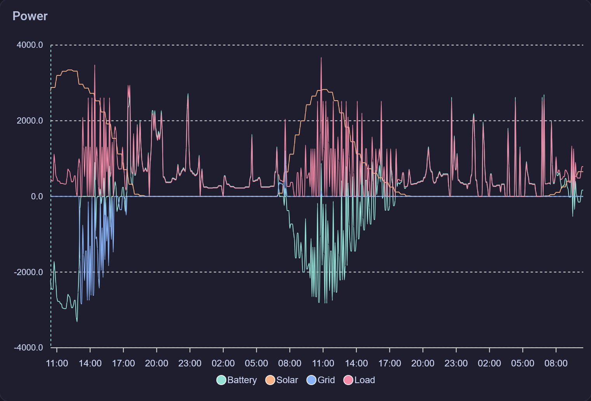
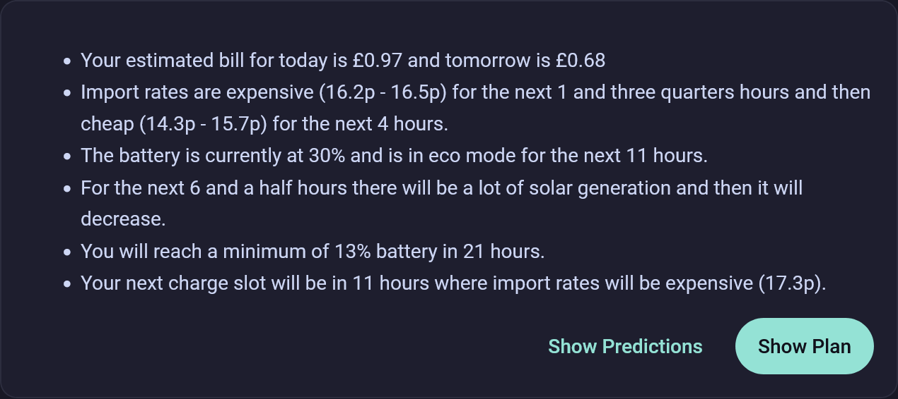
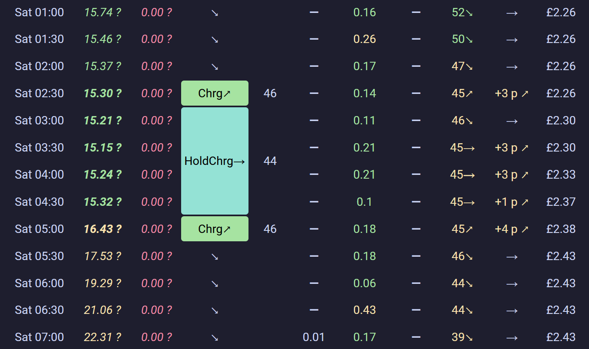

## Prediction Graphs

All of these graphs make use of the [Apexcharts Card](https://github.com/RomRider/apexcharts-card), and are stripped down versions of the defaults provided by Predbat. I find these more easily interpretable than the defaults.

### Energy Rates Prediction



Above is a demo chart showing predicted energy rates for the 48 hours. Every day at 4pm octopus release the known rates for the next day, so the first 24 hours are known and the next 24 hours are predicted. I have also enabled the extrema markers.

N.B. We are currently waiting on certification to get paid to export electricity, so our export rates are all 0. If your export rates are not 0, your plan will obviously be very different to ours.

```yaml
type: custom:apexcharts-card
header:
  show: true
  title: Energy rates
  show_states: true
  colorize_states: true
graph_span: 72h
span:
  start: day
  offset: "-0h"
now:
  show: true
series:
  - entity: predbat.rates
    stroke_width: 2
    curve: stepline
    name: Import
    color: var(--blue-color)
    data_generator: >
      let res = []; for (const [key, value] of
      Object.entries(entity.attributes.results)) { res.push([new
      Date(key).getTime(), value]); } return res.sort((a, b) => { return
      a[0] - b[0]  })
    show:
      in_legend: true
      legend_value: false
      in_header: false
      extremas: true
  - entity: predbat.rates_export
    stroke_width: 1
    type: area
    opacity: 0.2
    curve: stepline
    name: Export
    color: var(--purple-color)
    data_generator: >
      let res = []; for (const [key, value] of
      Object.entries(entity.attributes.results)) { res.push([new
      Date(key).getTime(), value]); } return res.sort((a, b) => { return
      a[0] - b[0]  })
    show:
      in_legend: true
      legend_value: false
      in_header: false
      extremas: true
```

### Solar Prediction



Above is a demo chart showing predicted solar generation for the next 48 hours. Notice that there are two prediction lines, the lighter shaded area is the 10th percentile forecast, this means that there is only a 10% chance that the actual generation will be lower than this line, this is useful for battery management as it means that you can be 90% sure that you will have at least this much solar generation. The darker line is the median forecast, this means that there is a 50% chance that the actual generation will be lower than this line.

```yaml
type: custom:apexcharts-card
header:
  title: Solar forecast
  show: true
  show_states: true
  colorize_states: true
graph_span: 72h
span:
  start: day
  offset: "-0h"
now:
  show: true
yaxis:
  - id: kWh
    show: true
    min: 0
    max: 5
series:
  - entity: predbat.pv_power
    name: Solar Power
    type: line
    stroke_width: 2
    float_precision: 2
    color: var(--orange-color)
    yaxis_id: kWh
    unit: kW
    extend_to: now
    group_by:
      func: avg
      duration: 15m
    show:
      in_legend: true
      legend_value: false
      in_header: false
  - entity: sensor.predbat_pv_today
    name: Forecast
    color: grey
    opacity: 0.3
    stroke_width: 0
    type: area
    time_delta: +15min
    extend_to: false
    yaxis_id: kWh
    data_generator: |
      return entity.attributes.detailedForecast.map((entry) => {
            return [new Date(entry.period_start), entry.pv_estimate];
          });
    show:
      in_header: false
      in_legend: false
  - entity: sensor.predbat_pv_today
    name: Forecast 10%
    color: grey
    opacity: 0.3
    stroke_width: 0
    type: area
    time_delta: +15min
    extend_to: false
    yaxis_id: kWh
    data_generator: |
      return entity.attributes.detailedForecast.map((entry) => {
            return [new Date(entry.period_start), entry.pv_estimate10];
          });
    show:
      in_header: false
      in_legend: false
  - entity: sensor.predbat_pv_tomorrow
    name: Forecast
    color: grey
    opacity: 0.3
    stroke_width: 0
    type: area
    time_delta: +15min
    extend_to: false
    yaxis_id: kWh
    data_generator: |
      return entity.attributes.detailedForecast.map((entry) => {
            return [new Date(entry.period_start), entry.pv_estimate];
          });
    show:
      in_header: false
      in_legend: false
  - entity: sensor.predbat_pv_tomorrow
    name: Forecast 10%
    color: grey
    opacity: 0.3
    stroke_width: 0
    type: area
    time_delta: +15min
    extend_to: false
    yaxis_id: kWh
    data_generator: |
      return entity.attributes.detailedForecast.map((entry) => {
            return [new Date(entry.period_start), entry.pv_estimate10];
          });
    show:
      in_header: false
      in_legend: false
  - entity: sensor.predbat_pv_d2
    name: Forecast
    color: grey
    opacity: 0.3
    stroke_width: 0
    type: area
    time_delta: +15min
    extend_to: false
    yaxis_id: kWh
    data_generator: |
      return entity.attributes.detailedForecast.map((entry) => {
            return [new Date(entry.period_start), entry.pv_estimate];
          });
    show:
      in_header: false
      in_legend: false
  - entity: sensor.predbat_pv_d2
    name: Forecast 10%
    color: grey
    opacity: 0.3
    stroke_width: 0
    type: area
    time_delta: +15min
    extend_to: false
    yaxis_id: kWh
    data_generator: |
      return entity.attributes.detailedForecast.map((entry) => {
            return [new Date(entry.period_start), entry.pv_estimate10];
          });
    show:
      in_header: false
      in_legend: false
```

### Power Prediction



Above is a demo chart showing predicted power for the next 48 hours. This graph shows the predicted solar and load power, and the predicted battery and grid power based on the plan created.

```yaml
type: custom:apexcharts-card
header:
  show: true
  title: Power
  show_states: true
  colorize_states: true
graph_span: 48h
span:
  start: minute
  offset: "-0h"
now:
  show: true
series:
  - entity: predbat.battery_power
    stroke_width: 1
    curve: smooth
    name: Battery
    color: var(--primary-color)
    unit: W
    data_generator: >
      let res = []; for (const [key, value] of
      Object.entries(entity.attributes.results)) { res.push([new
      Date(key).getTime(), value*1000.0]); } return res.sort((a, b) => {
      return a[0] - b[0]  })
    show:
      in_legend: true
      legend_value: false
      in_header: false
  - entity: predbat.pv_power
    stroke_width: 1
    curve: smooth
    name: Solar
    color: var(--orange-color)
    unit: W
    data_generator: >
      let res = []; for (const [key, value] of
      Object.entries(entity.attributes.results)) { res.push([new
      Date(key).getTime(), value*1000.0]); } return res.sort((a, b) => {
      return a[0] - b[0]  })
    show:
      in_legend: true
      legend_value: false
      in_header: false
  - entity: predbat.grid_power
    stroke_width: 1
    curve: smooth
    name: Grid
    color: var(--blue-color)
    unit: W
    data_generator: >
      let res = []; for (const [key, value] of
      Object.entries(entity.attributes.results)) { res.push([new
      Date(key).getTime(), value*1000.0]); } return res.sort((a, b) => {
      return a[0] - b[0]  })
    show:
      in_legend: true
      legend_value: false
      in_header: false
  - entity: predbat.load_power
    stroke_width: 1
    curve: smooth
    name: Load
    color: var(--red-color)
    unit: W
    data_generator: >
      let res = []; for (const [key, value] of
      Object.entries(entity.attributes.results)) { res.push([new
      Date(key).getTime(), value*1000.0]); } return res.sort((a, b) => {
      return a[0] - b[0]  })
    show:
      in_legend: true
      legend_value: false
      in_header: false
```

## Plan Cards

### Summary Card



This card shows a verbal summary of the current plan, it is provided by Predbat as an attribute of the `predbat.plan_html` entity. This is rendered using the [HTML Template Card](https://github.com/PiotrMachowski/Home-Assistant-Lovelace-HTML-Jinja2-Template-card). I have also added two buttons to navigate to the Predictions and Plan pages in my dashboard.

```yaml
type: custom:html-template-card
ignore_line_breaks: true
content: >
  {{ state_attr('predbat.plan_html', 'text') }}

  <div style="display: flex; justify-content: end; gap: 0.5rem">

  <ha-button href="/energy-custom/predictions" appearance="plain"
  variant="brand" size="medium">Show Predictions</ha-button>

  <ha-button href="/energy-custom/plan" variant="brand" size="medium">Show
  Plan</ha-button>
```

### Plan Table Card



This card shows the current plan in a table format, it is provided by Predbat as an attribute of the `predbat.plan_html` entity. This is rendered using the [HTML Template Card](https://github.com/PiotrMachowski/Home-Assistant-Lovelace-HTML-Jinja2-Template-card). I have added custom CSS styling to make it fit better in the card and follow the selected theme.

```yaml
type: custom:html-template-card
ignore_line_breaks: true
content: |
  <style>
    ha-card {
      overflow-x: scroll;
    }
    table {
      background-color: var(--card-background-color);
    }
    td {
      color: var(--primary-text-color);
      background-color: transparent;
      padding-inline: 0.5em;
      text-align: center;
    }
    td[bgcolor="#FFFFFF"] {
    }
    td[bgcolor="#3AEE85"] {
      color: var(--green-color);
    }
    td[bgcolor="#3AEE85"]:nth-child(4) {
      color: var(--background-color);
      background-color: var(--green-color);
      border-radius: 0.25em;
    }
    td[bgcolor="#34DBEB"]:nth-child(4) {
      color: var(--background-color);
      background-color: var(--cyan-color);
      border-radius: 0.25em;
    }
    td[bgcolor="#F18261"] {
      color: var(--red-color);
    }
    td[bgcolor="#FFFF00"] {
      color: var(--yellow-color);
    }
    td[bgcolor="#FFAAAA"] {
      color: var(--pink-color);
    }
    td[bgcolor="#74C1FF"] {
      color: var(--blue-color);
    }
    td[bgcolor="#AAFFAA"] {
      color: var(--lime-color);
    }
    td[bgcolor="#FFFFAA"] {
      color: var(--amber-color);
    }
  </style>
  {{ state_attr('predbat.plan_html', 'html') }}
```

## Power Flow Card

The [Power Flow Plus Card](https://github.com/flixlix/power-flow-card-plus) is a custom card for Home Assistant that provides a visual representation of power flow in your home.

```yaml
type: custom:power-flow-card-plus
entities:
  battery:
    entity: sensor.solax_battery_power_charge
    state_of_charge: sensor.solax_battery_percentage
    show_state_of_charge: true
    invert_state: true
    color_circle: true
    color:
      consumption: var(--cyan-color)
      production: var(--pink-color)
  grid:
    secondary_info: {}
    entity:
      consumption: sensor.solax_grid_import
      production: sensor.solax_grid_export
    use_metadata: false
    power_outage:
      entity: sensor.solax_grid_status
      state_alert: OffGrid
    color_circle: true
    color:
      consumption: var(--blue-color)
      production: var(--purple-color)
  solar:
    display_zero_state: true
    entity: sensor.solax_pv_power_total
    use_metadata: false
    color: var(--orange-color)
  fossil_fuel_percentage:
    secondary_info: {}
    entity: sensor.co2_signal_co2_intensity
    state_type: percentage
    use_metadata: false
    color: var(--green-color)
  home:
    secondary_info: {}
    invert_state: true
    use_metadata: false
    subtract_individual: false
    entity: sensor.solax_house_load_alt
  individual:
    - entity: sensor.kitchen_smart_plug_instantaneous_demand
      secondary_info: {}
      name: Slow Cooker
      icon: mdi:pot-steam
      color_value: false
      color_icon: false
      calculate_flow_rate: true
      use_metadata: false
      color: var(--red-color)
      display_zero_tolerance: 1
clickable_entities: true
display_zero_lines:
  mode: transparency
  transparency: 50
  grey_color: var(--grey-color)
use_new_flow_rate_model: true
w_decimals: 0
kw_decimals: 1
min_flow_rate: 0.75
max_flow_rate: 6
max_expected_power: 2000
min_expected_power: 0.01
watt_threshold: 1000
transparency_zero_lines: 0
sort_individual_devices: false
view_layout:
  position: main
disable_dots: false
title: Current State
```

## My Overall Dashboard

My energy dashboard is essentially an extension of the default Home Assistant Energy dashboard. I use the sidebar layout and the lesser documented [energy cards](https://home-assistant.io/dashboards/energy/#energy-cards) to bring the default functionality. I use the [Energy Entity Row](https://github.com/zeronounours/lovelace-energy-entity-row) and statistics graph cards to show details about the selected time period.
