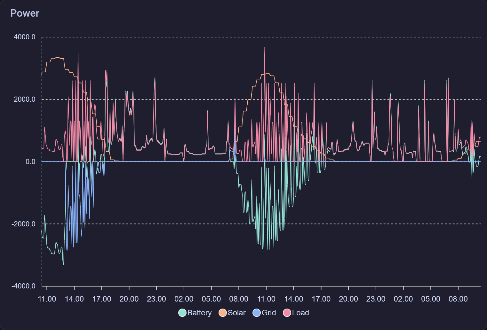

[Predbat](https://springfall2008.github.io/batpred/) is an open-source battery optimiser for your home solar and battery system.

It uses a model to predict your solar generation ([Solcast](https://solcast.com/)), a model to predict Octopus Agile prices (if you use it) and it creates and uses a model to predict your load power (consumption). Combining these three models, it will produce a plan to charge/discharge your battery in the most cost-effective way, it can also manage your car charging.

The graph above shows the predicted power from the solar and load models.

This graph shows the predicted power on the battery and grid, based on the plan created. Notice when the battery is full because there is lots of grid export.

## Home Assistant Integration

The beauty of Predbat is how it integrates with Home Assistant. It can be run purely using APIs (Octopus, Solcast, your inverter, etc.), but you have the option of directing it to make use of entities from integrations that you already have set up in Home Assistant.

In the case of my setup, I use the Solcast and Octopus integrations and the Solax Modbus integration for my inverter. However the Agile prediction is an external API.

Predbat also creates a number of useful sensors in Home Assistant that you can use in your dashboards, automations and scripts. Annoyingly, Predbat creates a lot of sensors with `predbat.*` ids that don't support long term statistics, so I have created template sensors that copy the value to get around this.

## Success in our setup

We have seen Predbat save us up to £4 per day in energy costs compared to using the self-use mode on our inverter. Originally on a fixed tariff (24p/kWh), Predbat could only take advantage of Free Energy Sessions to charge the battery, but now on the Agile tariff, Predbat tends to charge the battery overnight or during the working day when energy is cheap (low grid demand and lots of wind power on the grid); we have seen energy rates go negative more often than expected, even reaching -2.2p/kWh at one point. Overall, on the Agile tariff, we have seen an average price of ~15p/kWh, but we only charge when the energy is really cheap, so our effective price is lower than that. Bear in mind that energy prices could sky rocket to 99p/kWh. Another consideration is that the standing charge for Agile is higher than our previous tariff, but that difference is significantly less than the savings we are making. All of this cost saving without getting paid for energy that we export, which we are currently waiting on certification for, I know that our savings are going to significantly increase.

## Understanding the outputs

### Solar Model

The solar model will output a forecast (median) and 10% forecast (10th percentile) for the next 48 hours. The 10% forecast is used to ensure that the plan is robust against uncertainty in the solar forecast. The 10% forecast is typically around 20-30% lower than the median forecast, but this can vary significantly depending on the weather conditions. Predbat can be 90% sure that the actual solar generation will be above the 10% forecast.

### Rates Model

When using Octopus Agile, the rates will be known for the next 24 hours, but the rates for the following 24 hours will be predicted. The prediction is based on historical data and the current market conditions and weather. Only the median forecast is used for the rates model.

### Load Model

| PV     | Baseline                                       | Best                                  |
| ------ | --------                                       | ------------------------------------- |
| Median | Predbat does nothing, Solar at median          | Predbat optimised for solar at median |
| 10%    | Predbat does nothing, Solar at 10th percentile | Predbat optimised for 10th percentile |

#### Baseline

The baseline model predicts the house load if Predbat did not control the battery. It uses historical data to predict the load for the next 48 hours. There is also a PV 10% baseline model that predicts the house load if Predbat does nothing and the solar generation is at the 10% forecast level.

#### Best

The best model predicts the house load if Predbat controls the battery to optimise for the lowest cost. It uses historical data and the current state of the battery to predict the load for the next 48 hours. There is also a PV 10% best model that predicts the house load if Predbat controls the battery and the solar generation is at the 10% forecast level.

### Battery and Grid Predictions

The battery and grid predictions are based on the solar and load models. It knows how much power balancing is needed: `balancing power = load - solar` and it knows the battery constraints (max charge/discharge power, capacity, efficiency, etc.), so it can expect to charge/discharge the battery until it is full/empty and then use the grid.

### Cost Predictions

The cost predictions are based on the rates model and grid predictions. It calculates the cost of energy from the grid and the revenue from exporting energy to the grid. It then adds the standing charge to get the total cost.
